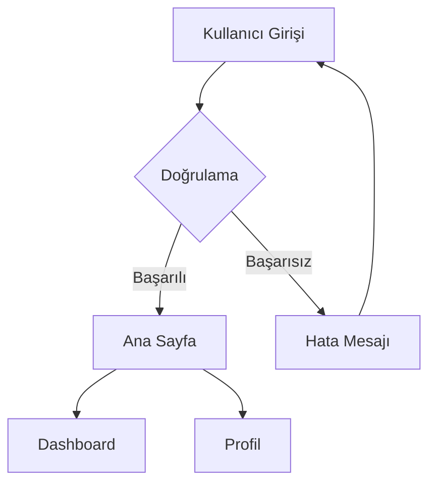

# Mermaid → FigJam Plugin

Mermaid flowchart kodunu FigJam'de düzenlenebilir akışlara dönüştüren Figma/FigJam plugin'i.

## Kurulum (Yerel Geliştirme)

### 1. Plugin dosyalarını hazırla

Bu klasördeki 3 dosya yeterli:
- `manifest.json` — Plugin tanımı
- `ui.html` — Kullanıcı arayüzü
- `code.js` — Mermaid parser + FigJam API

### 2. FigJam'de plugin'i yükle

1. FigJam'de yeni bir dosya aç (veya mevcut bir FigJam board'u aç)
2. **Menü** → **Plugins** → **Development** → **Import plugin from manifest…**
3. Bu klasördeki `manifest.json` dosyasını seç
4. Plugin listende "Mermaid to FigJam" görünecek

### 3. Plugin'i çalıştır

1. FigJam board'unda sağ tıkla → **Plugins** → **Development** → **Mermaid to FigJam**
2. Açılan pencereye Mermaid kodunu yapıştır
3. Mod seç:
   - **Sticky Note**: Her düğüm bir yapışkan not olarak oluşturulur
   - **Shape + Text**: Her düğüm şekilli bir FigJam shape olarak oluşturulur (önerilen)
4. **"FigJam'de Oluştur"** butonuna tıkla

## Desteklenen Mermaid Özellikleri

- `flowchart TD/LR/BT/RL` yön desteği
- Düğüm şekilleri: `[dikdörtgen]`, `(yuvarlak)`, `{eşkenar dörtgen}`, `[(silindir)]`
- Ok tipleri: `-->`, `---`, `-.->`, `==>`
- Kenar etiketleri: `-->|etiket|`
- Subgraph'ler (FigJam Section olarak)
- Zincir oklar: `A --> B --> C`

## Örnek

## Notlar

- FigJam'de `createShapeWithText()` API'si kullanılır — klasik Figma Design'dan farklıdır
- Subgraph'ler FigJam Section olarak oluşturulur
- Diamond şekli gerçek diamond olarak render edilir
- Connector'lar otomatik ok ucu ile oluşturulur
- Plugin sadece FigJam'de çalışır (Figma Design'da değil)

## Önemli: Figma Community'ye Yayınlama

Eğer plugin'i başkalarıyla paylaşmak istersen:
1. https://www.figma.com/developers adresinden Developer hesabı oluştur
2. Plugin'i Publish et (Figma Desktop App → Plugins → Manage → Publish)
3. Review süreci ~1-2 hafta sürer
